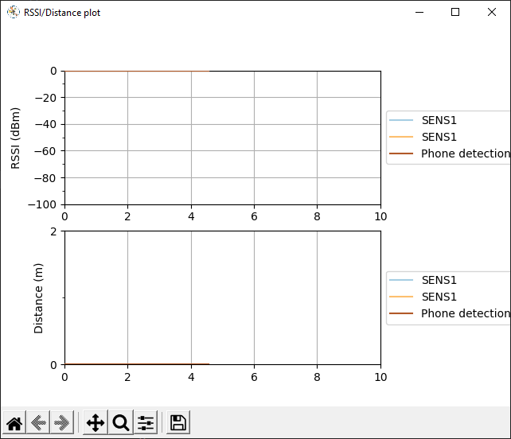

# ble_plot

`ble_plot` is a simple and quick implementation of BLE RSSI data plotter
written in Python.

It also writes all the data to the CSV data file so may be usefull if you need
to check something particular in regards to data packets.

It is not a perfect from technical point of view, it is not very accurate in
time but it is suitable for simple usage to plot a BLE RSSI signal.



## Usage

Create and activate python virtualenv
```bash
virtualenv .venv
```

Start virtualenvironment
```bash
# for Windows
./.venv/Scripts/activate
# for Linux
source .venv/bin/activate
```

Install dependencies
```bash
pip install -r ./requirements.txt
```

Create a config.json file from template and add either MAC addresses or
characteristics which is being broadcasted (for devices without constant MAC or
similar)
```bash
cp config_template.json config.json
```

Run script
```bash
python ./ble_py.py
```

## Contributing
Pull requests are welcome. But I have no further plans to develop this project
at the moment.

## License
[MIT](https://choosealicense.com/licenses/mit/)